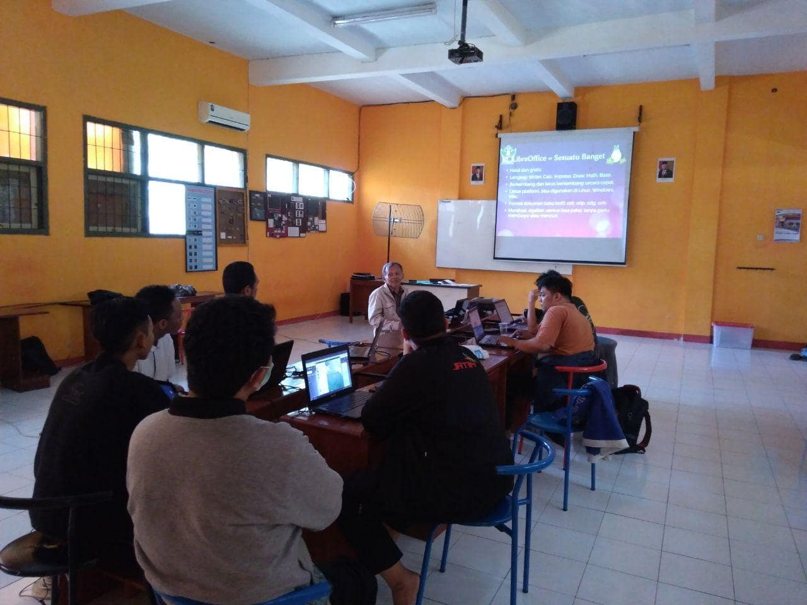
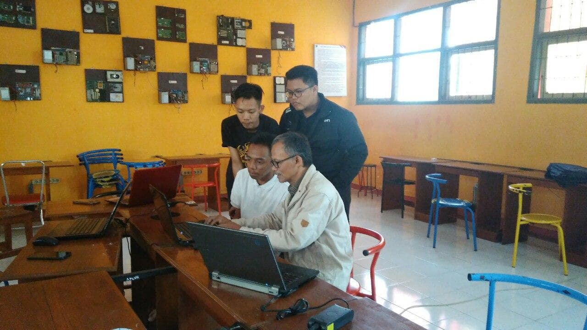

Sejumlah anggota Komunitas Linux Jember meramaikan kopdar ketiga pada hari Sabtu (14 / 12) yang lalu. Peserta yang didominasi kalangan pelajar dan mahasiswa ini antusias memperhatikan setiap detail penjelasan dari Pak Tasliman selaku pembicara. Dalam materi yang dibawakannya, Pak Tasliman berpesan untuk meninggalkan cara cara "jahilliyah" yaitu tidak menggunakan semua fitur dari aplikasi pengolah kata. Dengan fitur style pada LibreOffice yang didemonstrasikan pada kopdar kali ini, para mahasiswa dapat membuat template karya ilmiah dengan rapi dan terstruktur. Selain itu, proses pembuatan karya ilmiah dapat lebih mudah dan menyenangkan.

Pada *mini workshop* yang diadakan di Laboratorium TKJ SMKN 2 Jember, Pak Tasliman mendemonstrasikan bagaimana mengubah draft karya ilmiah berformat .txt, menjadi karya ilmiah berformat .odt lengkap dengan daftar isi, daftar tabel, dan daftar gambar. Penggunaan style juga membuat pengerjaan lebih mudah karena dengan fitur navigator, jika ada yang perlu direvisi, tidak perlu susah mencari dan memperbaikinya. Pak Tasliman berharap para peserta yang hadir dapat mengajak teman-teman yang lain untuk menggunakan LibreOffice karena kemutakhiran fitur yang dimiliki dan cukup nyaman digunakan. Unsur keberkahan dalam mencari ilmu juga ditekankan oleh dosen senior Fakultas Teknologi Pertanian Universitas Jember ini.

Salah seorang peserta, Zulfikar, berceloteh, bahwa ilmu baru yang telah dipelajarinya dapat dimanfaatkan untuk menjual jasa pengetikan dan penyuntingan karya ilmiah. Selain praktis dan mudah digunakan, jasa tersebut sangat menguntungkan karena banyak peminatnya. 

