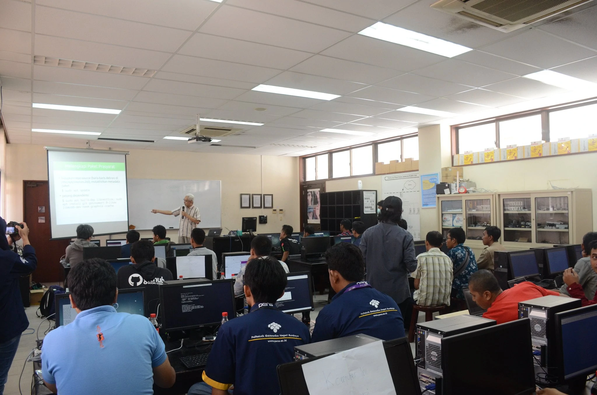
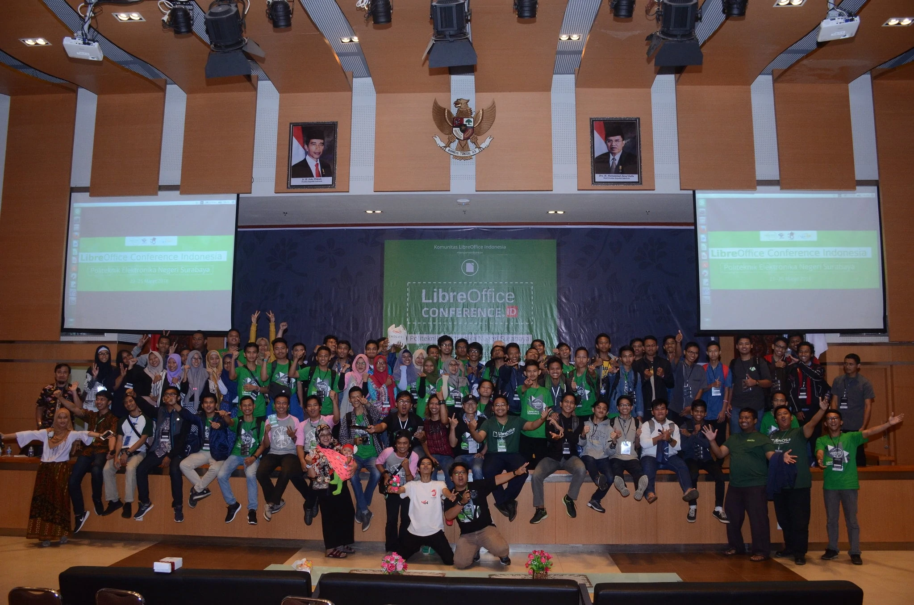

### Cikal Bakal Komunitas LibreOffice Indonesia

Konferensi LibreOffice Indonesia merupakan sebuah acara yang mengumpulkan pengguna, kontributor, dan pengembang LibreOffice yang ada di Indonesia. Diadakan di Surabaya, tepatnya di Politeknik Elektronika Negeri Surabaya (PENS), pada tanggal 23 hingga 25 Maret 2019. Pada hari pertama, diadakan lokakarya dengan topik penerjemahan dan build test yang dipandu oleh Pak **Andika Triwidada**, salah satu anggota **The Document Foundation** dari Indonesia. Peserta yang didominasi oleh pelajar dan mahasiswa ini sangat antusias mengikuti sesi lokakarya ini.

Acara utama digelar pada tanggal 24-25 Maret 2019. Pada hari Sabtu, dihadiri oleh **Franklin Weng** dan **Riki Arif Gunawan** yang menjadi *keynote speaker*. Acara konferensi pada hari pertama ini cukup seru karena dihadiri oleh salah seorang pendiri TDF yaitu **Italo Vignoli** yang membawakan materi tentang lokakarya sertifikasi LibreOffice pada salah satu kelas paralel. 

Pada hari Minggu, antusiasme dan semangat para peserta konferensi semakin bertambah. Hal tersebut dapat dibuktikan pada jumlah peserta yang hadir yang mengikuti acara hingga akhir yang sangat banyak. Sesi pertama diisi oleh Pak **Noor Azam** dan **Italo Vignoli** sebagai *keynote speaker*. Kelas paralel hari kedua konferensi juga tak kalah seru. Kontributor senior, Pak **Sokibi** juga hadir membagikan ceritanya tentang menulis buku menggunakan LibreOffice. Buku tersebut menjadi buku panduan dalam menggunakan LibreOffice Writer. Selain Franklin Weng dan Italo Vignoli, ada juga nama **Eric Sun** yang hadir dari Taiwan untuk memeriahkan konferensi LibreOffice Indonesia.

Acara yang menjadi tonggak awal berdirinya LibreOffice ID ini diakhiri dengan sesi tanya jawab kepada anggota inti The Document Foundation.

Selain konferensi yang terdiri dari beberapa genre acara, seperti pembicara utama, sesi kelas dan lightning talk, acara ini juga menghadirkan konsep lokakarya dengan topik penerjemahan dan build test LibreOffice.
