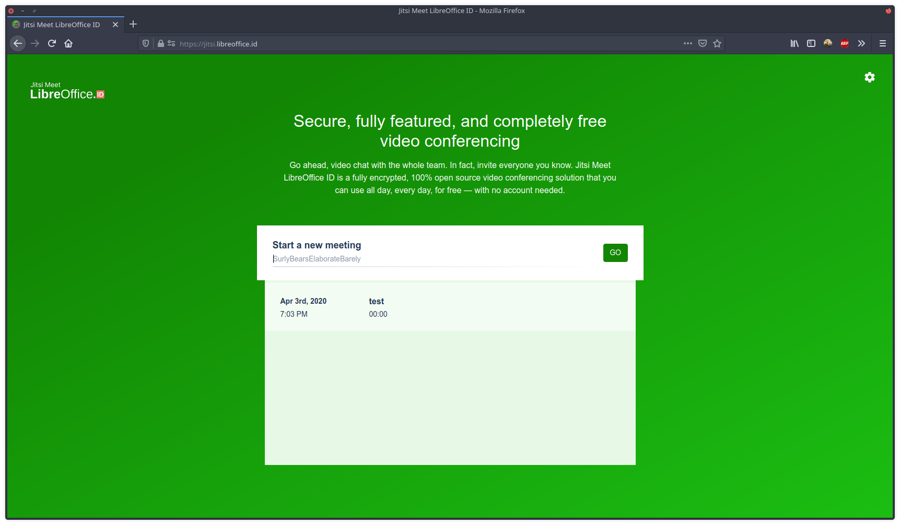
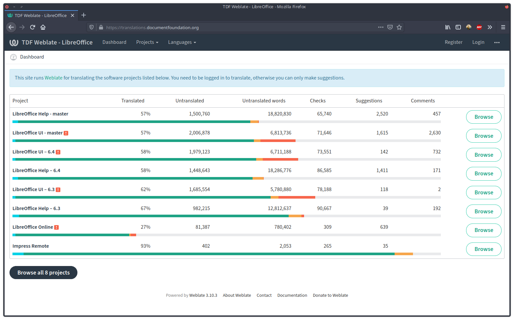

### Komunitas LibreOffice Indonesia Mengadakan Penerjemahan Daring LibreOffice

Virus Covid-19 yang kini mewabah Indonesia mengakibatkan adanya perintah untuk Social Distancing yang diserukan oleh pemerintah.Akan tetapi hal tersebut tidak menyulutkan semangat komunitas LibreOffice Indonesia untuk tetap menerjemahkan LibreOffice. Solusinya komunitas LibreOffice Indonesia mengadakan kegiatan penerjemahan via daring pada tanggal 28 Maret 2020 dengan memanfaatkan Jitsi yang dikelola juga oleh komunitas LibreOffice Indonesia yang beralamat di [Jitsi LibreOffice Indonesia](https://jitsi.libreoffice.id "Jitsi LibreOffice Indonesia").

Pada penerjemahan daring LibreOffice kali ini sedikit berbeda dengan yang sebelumnya dikarenakan ada sedikit perbedaan, yakni terkait alat penerjemahan, yang mana sebelumnya menggunakan Pootle, sekarang beralih menggunakan [Weblate](https://translations.documentfoundation.org "Weblate LibreOffice"). 

Hasil dari penerjemahan daring ini membuahkan hasil yang cukup positif dengan hasil terjemahan menuju 100%. 
