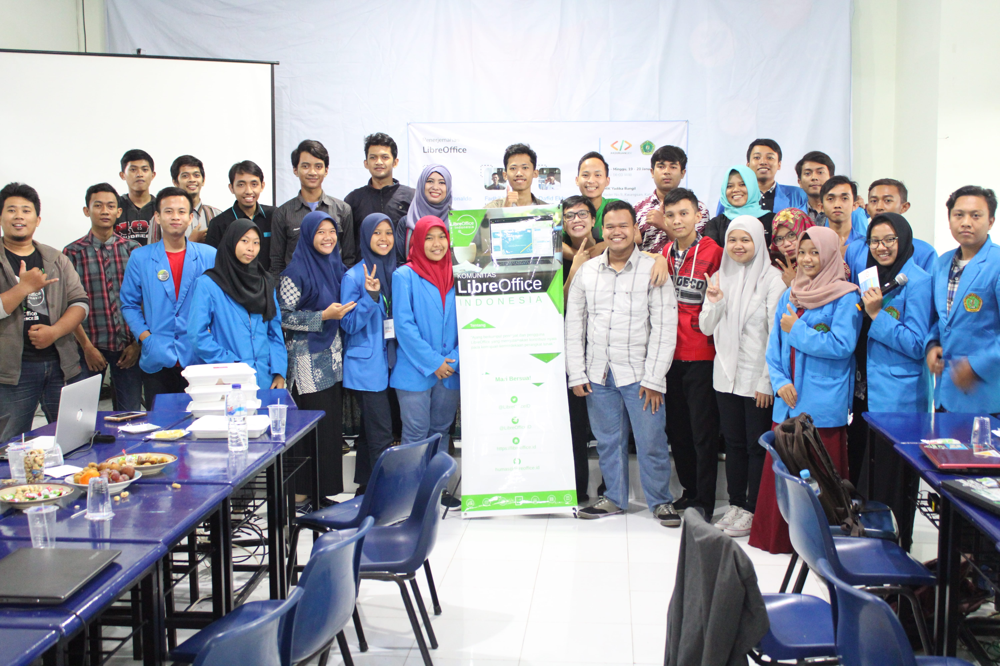

### Pasuruan menjadi Destinasi Penerjemahan Ketiga
Rangkaian Festival Penerjemahan LibreOffice berlanjut ke daerah ke-3, Kabupaten Pasuruan. Bertempat si STMIK Yadika Bangil, Jl. Bader No. 9, Kalirejo, Bangil, Pasuruan.

Acara yang diadakan oleh PasuruanDev dan bekerja sama dengan STMIK Yadika Bangil, Dicoding, KLAS, KLiM dan LibreOffice ID diadakan pada tanggal 19 hingga 20 Januari 2019.

Penerjemahan LibreOffice Pasuruan dimentori oleh langsung oleh 3 orang yang sebelumnya sudah mendapatkan wejangan dari Penerjemahan LibreOffice Jogja. Mereka adalah Imanuel Ronaldo, Fadhil Yodi, dan Dafid Ekhwani.

Penerjemahan LibreOffice Pasuruan mendapatkan hasil sebesar 70605 kata yang berhasil dialih bahasakan dari Inggris ke Indonesia.
