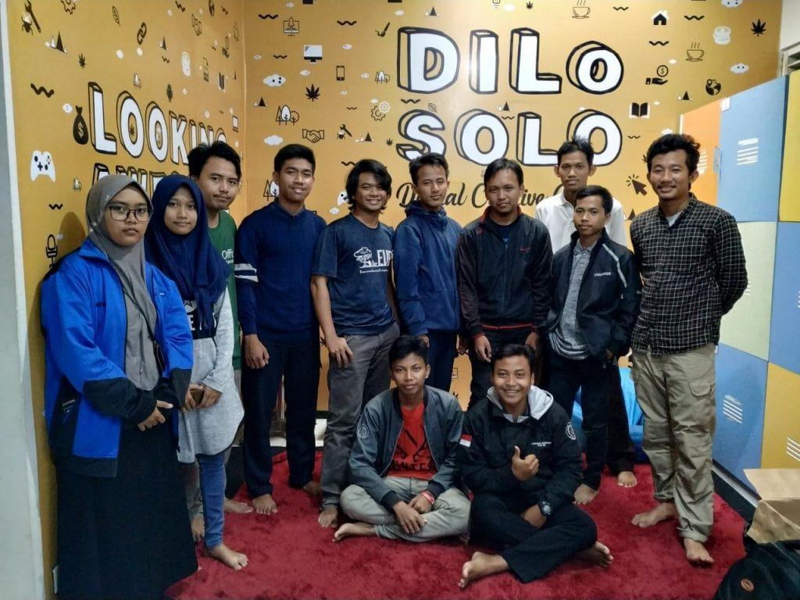

### Penerjemahan LibreOffice di Kota Solo

Rangkaian Festival penerjemahan LibreOffice minggu ke-4 di bulan Januari 2019, tepatnya pada tanggal 26 hingga 27, di DiLO Solo, Jl. Prof. Dr. Supomo No. 66, Punggawan, Banjarsari, Kota Surakarta, Jawa Tengah.

Acara didukung oleh LibreOffice ID dan DiLO Solo, KLAS, dan KLiM ini sukses diadakan dengan total kata yang dialih bahasakan sebanyak 50765.

Pada akhir acara, panitia Penerjemahan LibreOffice Solo juga mempromosikan acara lain yang juga akan diselenggarakan pada bulan Oktober. Acara yang dimaksud adalah openSUSE.Asia Summit 2019 dan GNOME.Asia Summit 2019.
