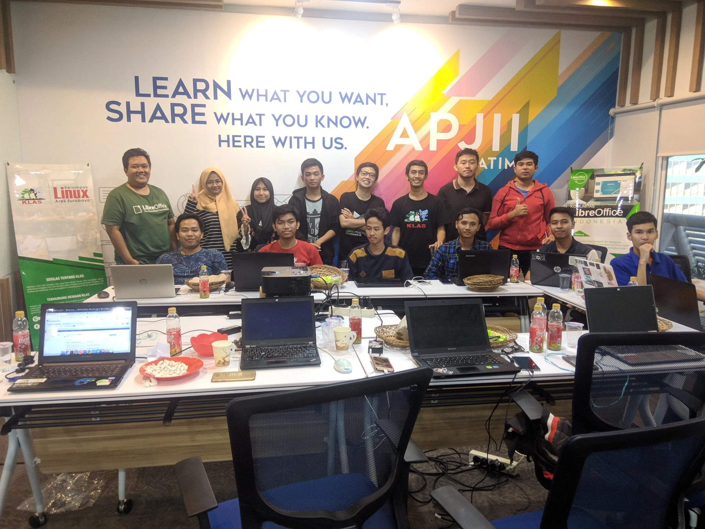

### Semangat Penerjemahan di Kota Pahlawan

Seakan tidak mau kalah dengan KLiM, Kelompok Linux Arek Suroboyo (KLAS) menggelar penerjemahan di kota Surabaya. Acara tersebut diadakan diadakan pada tanggal 12 hingga 13 Januari 2019.

Bekerja sama dengan APJII Jawa Timur, LibreOffice ID dan OSC (Open Source Community, PENS), acara ini sukses diadakan di Ruang Training APJII Jawa Timur.

Penerjemahan LibreOffice ini menghasilkan sekitar 29922 kata yang berhasil dialih bahasakan dari Inggris ke Indonesia.
