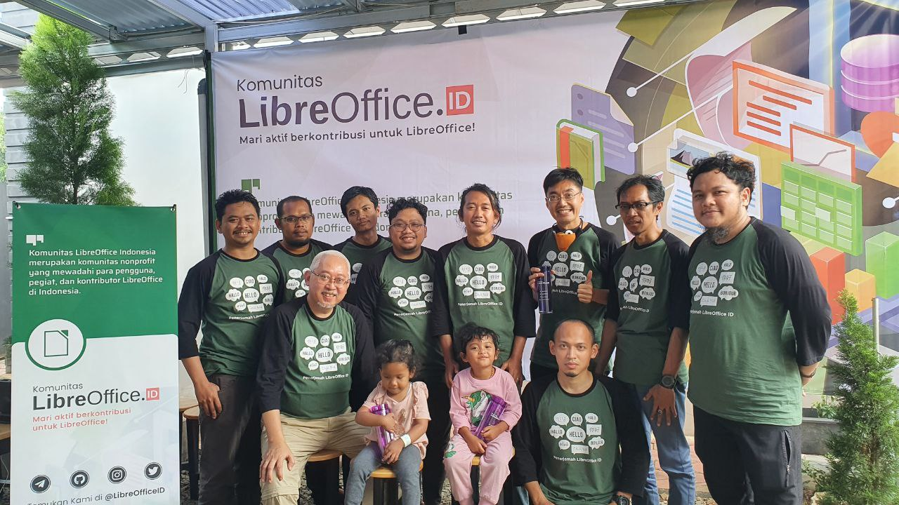
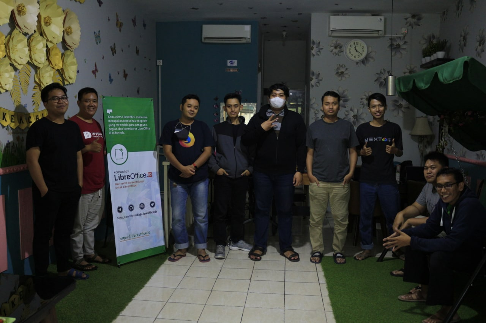

LibreOffice Translation & QA (LOTQ) 2022 telah sukses digelar di dua kota, Bogor (Jawa Barat) & Gresik (Jawa Timur) pada 13 & 14 Agustus 2022 lalu. Acara ini digelar sebagai bentuk kontribusi aktif komunitas LibreOffice ID untuk LibreOffice utamanya dalam hal penerjemahan dan juga QA.

Hadir dalam LOTQ 2022, Andika Triwidada sebagai mentor senior penerjemah Bahasa Indonesia. Sekitar 25 orang dari beragam latar belakang, hadir dan turut berpartisipasi dalam acara ini. Sangat disayangkan, pemateri untuk QA, Rizal Muttaqin berhalangan untuk hadir karena suatu hal, sehingga untuk topik QA diambil alih oleh Ahmad Haris.

Selama dua hari, para peserta dibimbing untuk menerjemahkan string dari bahasa sumber ke Bahasa Indonesia. Selain itu, kami juga mendiskusikan beberapa hal lain yang terkait dengan penerjemahan. Berikut adalah beberapa poin pertanyaan yang muncul dalam sesi diskusi;
Apakah halaman resmi LibreOffice dapat diterjemahkan ke dalam Bahasa Indonesia?
Kosa kata dalam pemeriksa ejaan di LibreOffice perlu diperbarui, untuk itu perlu adanya perbaikan kosa kata serta informasi pemenggalan masing-masing kata untuk diterapkan di pemeriksa ejaan LibreOffice.
Perlu diadakan survey dengan skala besar (estimasi 3000 partisipan) terkait komponen dan aspek yang sebaiknya menjadi prioritas penerjemahan. Berkaitan dengan hal ini, apakah TDF berkenan dan siap membantu pendanaan survei tersebut?

Untuk diketahui, dalam kegiatan LOTQ 2022 ini LibreOffice memberikan pendanaan kepada kami (penyelenggara) untuk pembuatan Kaos LibreOffice serta makan & snack selama kegiatan berlangsung, terima kasih.

Selain itu, beberapa perusahaan juga turut serta menyeponsori kegiatan ini. Sepatu Fans memberikan dana untuk membuat Botol LibreOffice yang keren untuk dibagikan secara gratis ke seluruh partisipan. BTECH dan IMTEK juga turut berdonasi untuk menyukseskan kegiatan yang dikelola oleh LibreOffice ID (Ahmad Haris & Rania Amina).

Dokumentasi:
[Dok. LibreOffice](https://album.raniaamina.id/index.php?/category/libreoffice-id-translation-2022) 

